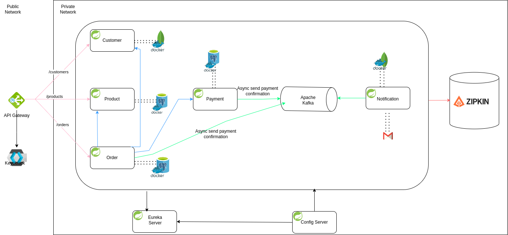

# E-Commerce Microservices Backend with Spring Boot

This project is a scalable and secure e-commerce backend built with Spring Boot using a microservices architecture. It features distributed tracing, secure authentication, asynchronous communication, email notifications, and data management with PostgreSQL and MongoDB. Each service is containerized with Docker and orchestrated with Docker Compose for easy deployment.

## Project Overview

### E-Commerce Features
- **User Management**: Register, authenticate, and manage customers.
- **Product Catalog**: Manage product inventory and details.
- **Order Processing**: Handle order placements, payments, and fulfillment.
- **Payment Integration**: Communicate with external payment services.
- **Notification Service**: Email updates on order status.
- **API Gateway**: Acts as the unified entry point for all services.

### Technical Highlights
- **Centralized Configuration**: Managed by a Configuration Server.
- **Service Discovery**: Ensures inter-service connectivity with Eureka.
- **Asynchronous Messaging**: Powered by Kafka for event-driven operations.
- **Distributed Tracing**: Zipkin and Spring Actuator for monitoring.
- **Security**: User roles and permissions managed by Keycloak.
- **Data Management**: PostgreSQL for transactions and MongoDB for document storage.
- **Containerization**: Docker & Docker Compose for modular deployment.

## Tech Stack
- **Java & Spring Boot**: Core backend framework.
- **PostgreSQL & MongoDB**: Databases for transactional and document storage.
- **Kafka & Zookeeper**: Supports asynchronous event handling.
- **Eureka**: Service discovery.
- **Zipkin**: Distributed tracing across services.
- **Keycloak**: Authentication and authorization.
- **MailDev**: Local email testing.
- **PgAdmin**: GUI for PostgreSQL management.
- **Docker & Docker Compose**: Manages service containerization.

## Architecture Overview



## E-Commerce Service Modules

1. **User Service**: Manages customer registration and profile details.
2. **Product Service**: Manages product listings, inventory, and details.
3. **Order Service**: Handles order placements, fulfillment, and tracking.
4. **Payment Service**: Manages interactions with payment providers.
5. **Notification Service**: Sends order confirmations and updates via email.

## Getting Started

### Prerequisites
- **Docker & Docker Compose**: Required to run services.
- **Java 17+**: Spring Boot version compatibility.
- **Keycloak**: Identity management for user authentication.

### Installation

1. **Clone the Repository**
   ```bash
   git clone https://github.com/yourusername/ecommerce-backend.git
   cd ecommerce-backend
2. **Environment Variables**
- **Create a .env file with custom configurations:**
    ```bash
    POSTGRES_USER=postgres
    POSTGRES_PASSWORD=vvs
    PGADMIN_DEFAULT_EMAIL=pgadmin@pgadmin.org
    PGADMIN_DEFAULT_PASSWORD=admin
    KAFKA_BOOTSTRAP_SERVERS=localhost:9092
    ZIPKIN_BASE_URL=http://localhost:9411
    KEYCLOAK_BASE_URL=http://localhost:9098/auth
3. **Run the Application**
    ```bash
   docker-compose up --build
## Accessing the Services
- **API Gateway**: http://localhost:8080
- **Eureka Dashboard**: http://localhost:8761
- **Zipkin Tracing**: http://localhost:9411
- **Keycloak Admin Console**: http://localhost:9098
- **PgAdmin**: http://localhost:5051
- **MailDev UI**: http://localhost:1080
- **Mongo Express**: http://localhost:8081 (MongoDB GUI)

## Monitoring and Tracing
- **Actuator**: Health checks and metrics at /actuator.
- **Zipkin**: Distributed tracing to monitor request flows.
## Security Configuration
- **Keycloak Integration**: Manages roles and permissions.
- **User Roles**: Customers have controlled access to order and product services.
## Data Management
- **PostgreSQL**: Primary database for transactional data.
- **MongoDB**: Stores document-based data for flexible data modeling.
- **PgAdmin**: PostgreSQL management and administration.
- **Mongo Express**: MongoDB management GUI.